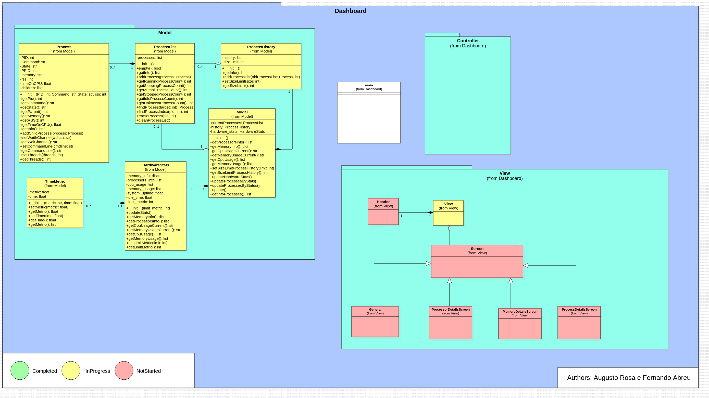

# Dashboard
Este projeto foi desenvolvido para a discipĺina de Sistemas Operacionais e tem como propósito obter informações do sistemas por meio de *system call* e/ou lendo informações na pasta */proc* no caso do linux.

## Índice
1. [Sobre o Projeto](#sobre-o-projeto)<br>
1.1. [Obtenção das informações do Sistema](#obtencao-das-informações-do-sistema)<br>
1.1.1 [Pasta /proc](#pasta-/proc)<br>
1.1.2. [Processador](#processador)<br>
1.1.3. [Memoria RAM](#memoria-ram)<br>
1.1.4. [Processos](#processos)<br>
1.2. [Diagrama de Classe](#diagrama-de-classe)
2. [Como Usar](#como-usar)<br>
2.1 [Como executar o dashboard](#como-executar-o-dashboard)<br>
2.1.1 [Passos](#passos)
3. [Estrutura de Pastas](#estrutura-de-pastas)
4. [Contribuições](#contribuição)<br>
4.1 [Como Contribuir](como-contribuir)
5. [Licença](#licença)

## Sobre o Projeto
O projeto Dashboard visa desenvolver um aplicativo que permita visualizar as
propriedades dos Sistemas Operacionais: Hardware do Sistemas, características dos processos em
execução, sistemas de Diretorios, etc

### Obtenção das informações do Sistema

#### Pasta /proc
A pasta **/proc** é um pseudo-sistema de arquivos presente em sistemas baseados em Linux. Ela não contém arquivos reais no disco; em vez disso, é gerada dinamicamente pelo kernel e reflete informações sobre o sistema e os processos em execução.

#### Processador
Foi lido dois arquivos da pasta */proc*.O arquivo *cpuinfo* com informações do fabricante do processador e *uptime* que contém dois valores flutuantes, sendo o primeiro o tempo em segundos que o sistema iniciou ou reiniciou e o segundo valor o somatorio do tempo que cada núcleo do processador ficou inativo.

#### Memoria RAM
Foi lido um arquivo da pasta */proc*.O arquivo *meminfo* que contem informações da memória RAM como Memória Total(MemTotal), Memória Livre(MemFree) e etc..

#### Processos
A obtenção dos dados do processo pode vir principalmente de dois arquivos dentro da pasta */proc/[PID]* sendo [PID] o número de processo específico: *stats* ou *status*
Para o arquivo stats as informações retiradas foram **PID**, **Command**, **State**, **PPID**, **RSS**(dado em páginas).Lembrando que cada página, por padrão, vale 4096 Bytes.
Para o arquivo status as informações retiradas foram **PID**, **Name**, **State**, **PPID**, **VmRSS**(dado em KB), **Threads**.
As outras informações a serem retiradas foram pelos arquivos dentro da pasta de cada processo com nomes: *cmdline* e *wchan*
O arquivo *cmdline* contem as informação da linha de comando que inicio esse processo.
O arquivo *wchan* que é *wait channel* contem informação sobre qual canal que um processo esta esperando.

### Diagrama de Classe


## Como Usar
Tenha python3 instalado na versão 3.10.12 e recomendável criar um ambiente virtual python para instalações dos pacotes usados no projeto.

### Como executar o dashboard

Para garantir que as dependências do projeto sejam instaladas de forma isolada e não afetem outras versões do Python no sistema, siga os passos abaixo para criar um ambiente virtual.

#### Passos:

1. **Instalar o Python**:
   Certifique-se de ter o Python 3.10.12 instalado no seu sistema. Você pode verificar a versão do Python instalada com o seguinte comando:
    ```bash
    python3 --version
2. **Criar o ambiente virtual python no diretório do projeto**:
    ```bash
    python3 -m venv venv
3. **Ativar o Ambiente Virtual**:
    ```bash
    source venv/bin/activate
4. **Instalar as dependências**:
    ```bash
    pip3 install -r requirements.txt
5. **Executar o dashboard**:
    ```bash
    python3 main.py
6. **Ao termina pode sair do ambiente virtual python**:
    ```bash
    deactivate

## Estrutura de Pastas

- **`docs/`**
  - `ClassDiagram.mdj`
  - `classDiagram.png`
  - `source.txt`
- **`model/`**
  - `hardwareStats.py`
  - `model.py`
  - `process.py`
  - `processHistory.py`
  - `processList.py`
  - `TimeMetric.py`
- `Makefile`
- `requirements.txt`
- `README.md`
- `main.py`
- `LICENSE`

## Contribuições

Contribuições são sempre bem-vindas! Para garantir que sua contribuição seja avaliada de maneira eficaz, siga estas etapas:

### Como Contribuir

1. **Fork do repositório**: Comece fazendo um fork deste repositório para sua conta no GitHub.
2. **Crie uma branch**: Crie uma nova branch com um nome que descreva o que você está fazendo. Por exemplo:
   ```bash
   git checkout -b nome-da-sua-branch

## Licença

Este projeto está licenciado sob a Licença MIT - consulte o arquivo [LICENSE](LICENSE) para mais detalhes.